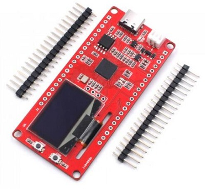
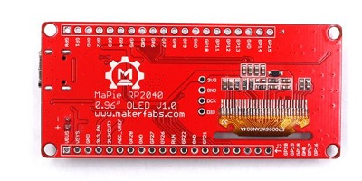

# MaPIE RP2040 0.96‘‘ OLED

```c++
/*
Version:		V1.0
Author:			Vincent
Create Date:	2022/11/23
Note:
	
*/
```


[toc]

# Makerfabs

[Makerfabs home page](https://www.makerfabs.com/)

[Makerfabs Wiki](https://makerfabs.com/wiki/index.php?title=Main_Page)


# MaPIE RP2040 0.96‘‘ OLED

## Intruduce


Product Link ：[]() 

Wiki Link : []() 


## Feature


### Front:



### Back:




# Arduino


## Compiler Options

**If you have any questions，such as how to install the development board, how to download the code, how to install the library. Please refer to :[Makerfabs_FAQ](https://github.com/Makerfabs/Makerfabs_FAQ)**

- Install board : Arduino Mbed OS RP2040 Boards
- Install library : Adafruit_GFX library.
- Install library : Adafruit_SSD1306 library.


Modify pins_Arduino.h

```c++
//variants\RASPBERRY_PI_PICO\pins_arduino.h

// Wire
// #define PIN_WIRE_SDA        (4u)
// #define PIN_WIRE_SCL        (5u)

// Change By Vincent
#define PIN_WIRE_SDA        (6u)
#define PIN_WIRE_SCL        (7u)
```

**First time upload need hold boot button when restart.**


# MicroPython

## Burn Fireware

Download MicroPython from the Raspberry PI Pico's official tutorial:

[https://www.raspberrypi.com/products/raspberry-pi-pico/](https://www.raspberrypi.com/products/raspberry-pi-pico/)


## Upload Code

Connect MaPie to PC.

Use Thonny IDE, upload all file to MaPie.

