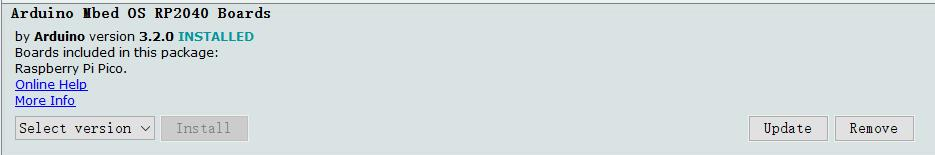

# MaPIE RP2040 0.96‘‘ OLED

```c++
/*
Version:		V1.0
Author:			Vincent
Create Date:	2022/11/23
Note:
	
*/
```


[toc]

# Makerfabs

[Makerfabs home page](https://www.makerfabs.com/)

[Makerfabs Wiki](https://wiki.makerfabs.com/)


# MaPIE RP2040 0.96‘‘ OLED

## Intruduce

Product Link ：[MaPIE RP2040 0.96" OLED](https://www.makerfabs.com/mapie-rp2040-0-96-inch-oled.html) 

Wiki Link : [MaPIE RP2040 0.96" OLED](https://wiki.makerfabs.com/MaPIE_RP2040_0.96_OLED.html) 

This MaPIE RP2040 OLED is a low-cost, high-performance Pico-like MCU board with flexible digital interfaces. It is based on Raspberry Pi's RP2040 microcontroller chip, as same as that on Raspberry Pi Pico. Users can develop applications based on Raspberry Pi's C/C++ SDK, or the MicroPython/ Arduino.


## Feature

- P2040 microcontroller Dual-core Arm Cortex M0+ processor, flexible clock running up to 133 MHz
- 16MB on-board Flash memory
- USB-C connector
- 0.96" 128*64 OLED
- Lithium battery connector/ charge
- Same pins breakout as Pico: 26 x multi-function GPIO pins; 2 x SPI, 2 x I2C, 2 x UART, 3 x 12-bit ADC, 16 x controllable PWM channels


### Front:


### Back:


# Arduino


## Compiler Options

**If you have any questions，such as how to install the development board, how to download the code, how to install the library. Please refer to :[Makerfabs_FAQ](https://github.com/Makerfabs/Makerfabs_FAQ)**

- Install board : Arduino Mbed OS RP2040 Boards
- Install library : Adafruit_GFX library.
- Install library : Adafruit_SSD1306 library.



Modify pins_Arduino.h

```c++
//variants\RASPBERRY_PI_PICO\pins_arduino.h

// Wire
// #define PIN_WIRE_SDA        (4u)
// #define PIN_WIRE_SCL        (5u)

// Change By Vincent
#define PIN_WIRE_SDA        (6u)
#define PIN_WIRE_SCL        (7u)
```

**First time upload need hold boot button when restart.**


# MicroPython

## Burn Fireware

Download MicroPython from the Raspberry PI Pico's official tutorial:

[https://www.raspberrypi.com/products/raspberry-pi-pico/](https://www.raspberrypi.com/products/raspberry-pi-pico/)


## Upload Code

Connect MaPie to PC.

Use Thonny IDE, upload all file to MaPie.

