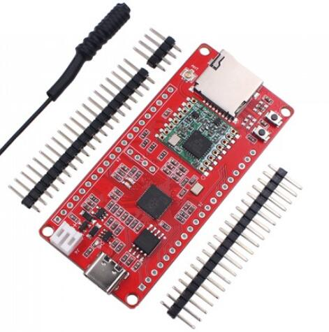
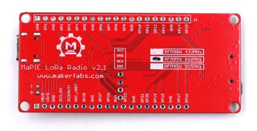

# MaPIE LoRa RP2040


```c++
/*
Version:		V1.1
Author:			Vincent
Create Date:	2022/6/2
Note:
				V1.0 Create Project
				V1.1 Add hardware file
			
*/
```

[toc]

# Makerfabs

[Makerfabs home page](https://www.makerfabs.com/)

[Makerfabs Wiki](https://wiki.makerfabs.com/)


# MaPIE LoRa RP2040

## Introduce

Product Link ：[MaPIE LoRa RP2040](https://www.makerfabs.com/mapie-lora-rp2040.html) 

Wiki Link : [MaPIE LoRa RP2040](https://wiki.makerfabs.com/MaPIE_LoRa_RP2040.html) 

Makerfabs MaPIE Lora is based on Raspberry Pi PICO RP2040 controller, with integration of flash and Lora RFM98W, to make it a good platform for RP2040 development of Lora applications.


## Feature

- Raspberry RP2040 MCU
- Lora frequency: 433M/ 868M/ 915M
- Support Micro SD Card
- On board Flash: 16MB
- Power: USB Type-C; battery; On board charger

### Front:



### Back:




# How To Use

## Complier Option

**If you have any questions，such as how to install the development board, how to download the code, how to install the library. Please refer to :[Makerfabs_FAQ](https://github.com/Makerfabs/Makerfabs_FAQ)**

- Please disconnect from the electrical equipment before burning!
- Do not burn with alternating current!
- Install library: RadioLib and other libs in Arduino IDE
- Upload codes, select "Arduino Mbed OS RP2040 Boards" and "Raspberry Pi Pico"

MaPIE Lora Radio use this Lora library: [RadioLib](https://github.com/jgromes/RadioLib)

**It is recommended to install from Arduino Library Manager and select the library version 4.6.0. RadioLib libraries after 5.0 need to add "RADIOLIB_" before some macro definitions.**

The current firmware is developed in RadioLib 4.6.0.


## Firmware

### MaPIE_LORA_V1.0 

The main function is to verify SD card and provide simple Lora reception.

Some SD cards tested are incompatible or have a low success rate, such as the Kingston 8G.

**We provide a compiled UF2 file that you can upload directly. Hold down BOOT and press RST. The RP2040 will convert to a USB drive and send the UF2 file to the USB drive for uploading.**