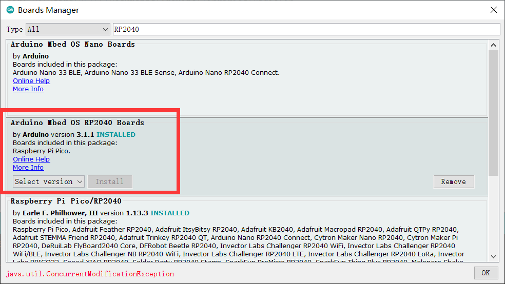

# Makerfabs MaPIE


```c++
/*
Version:		V2.1
Author:			Vincent
Create Date:	2022/6/2
Note:

2022/12/30		V2.1 Edit wiki link
2022/11/23		V2.0 Add MaPIE 0.96 OLED
2022/6/2		V1.0 Create Project
			
*/
```

[toc]

# Makerfabs

[Makerfabs home page](https://www.makerfabs.com/)

[Makerfabs Wiki](https://wiki.makerfabs.com/)


# What is MaPIE 

MaPIE is Makerfabs development board product line based on RP2040.

RP2040 is an MCU developed by Raspberry PI and can support Arduino, MicroPython and C_SDK development.

Compared to the traditional Arduino UNO 328P, it has better performance and more hardware resources. 


## MaPIE List

| Name                                                         | Status      |
| ------------------------------------------------------------ | ----------- |
| [MaPIE LoRa RP2040](MaPIE_Lora/)                     | **Already** |
| [MaPIE 0.96 OLED](MaPIE-0.96-OLED/) | **Already** |
|                                                              |             |


# How To Use

## Complier Option

**If you have any questions，such as how to install the development board, how to download the code, how to install the library. Please refer to :[Makerfabs_FAQ](https://github.com/Makerfabs/Makerfabs_FAQ)**

- Please disconnect from the electrical equipment before burning!
- Do not burn with alternating current!
- Open Arduino IDE
- Open boards Manager, search "RP2040"
- Install board:  Arduino Mbed OS RP2040 Boards(Version 3.1.1)




